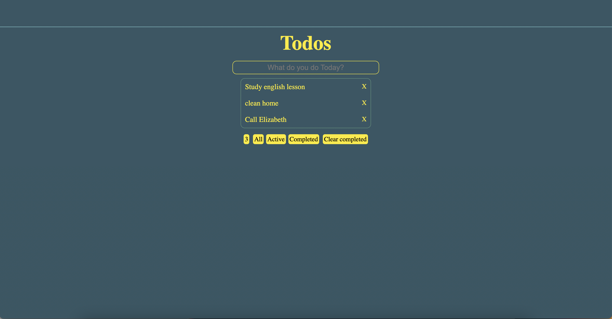

# React To-Do

### This project is a todo list application developed using React. Users can add, delete, and mark off tasks as completed.

---

[Try To-Do List](https://todo-exa.pages.dev/)

## Installation Instructions

1.  Clone or download the project:

        git clone https://github.com/muzaffercankaplan/wheather-app-React.git

2.  Go to the project directory and install the requirements:

        cd React-todo
        npm i

3.  Start the application:

        npm start
